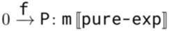
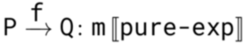
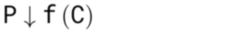
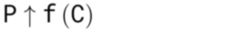
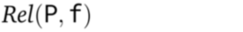
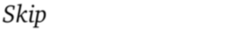
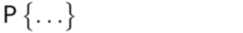
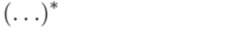
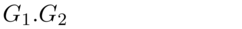

The session types used by this tool and their syntax are explained in the thesis
linked in the main readme.

However, this is a short overview of the ASCII-based representation of the
global session types which must be used when supplying a session specification
to this tool:

| Type                                     | Representation         |
|:-----------------------------------------|:-----------------------|
|  | `0 -f-> P:m<pure-exp>` |
|     | `P -f-> Q:m<pure-exp>` |
|       | `P resolves f with C`  |
|        | `P fetches f as C`     |
|       | `Rel(P, f)`            |
|            | `skip`                 |
|       | `P{...}`               |
|       | `(...)*`               |
|   | `G1.G2`                |

See also the examples at `evaluation/models/simple`.

